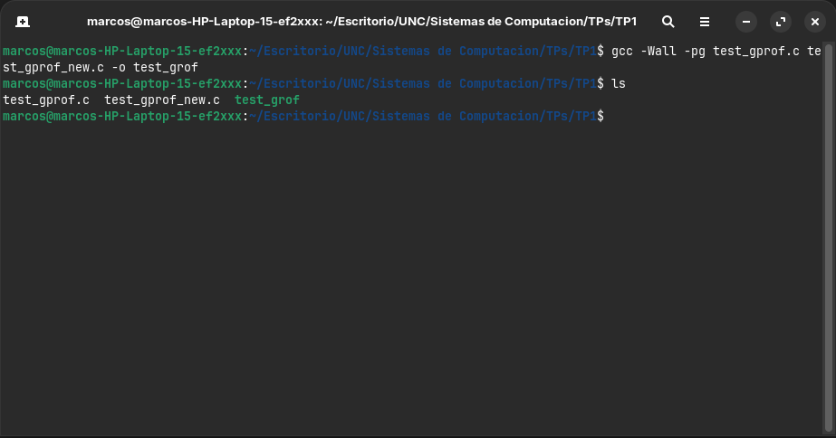
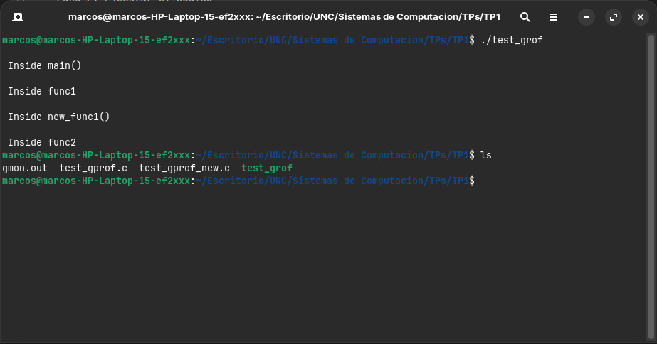
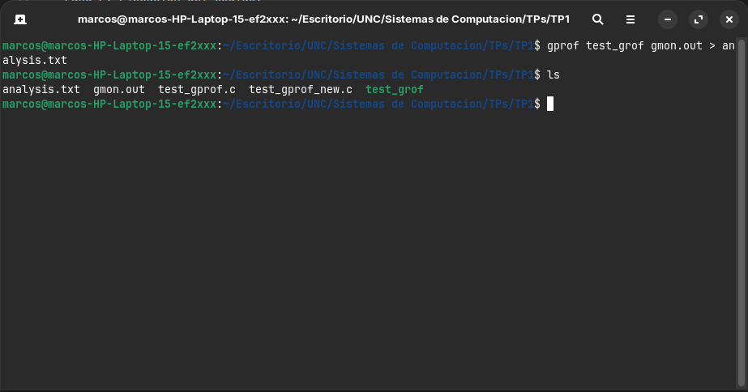
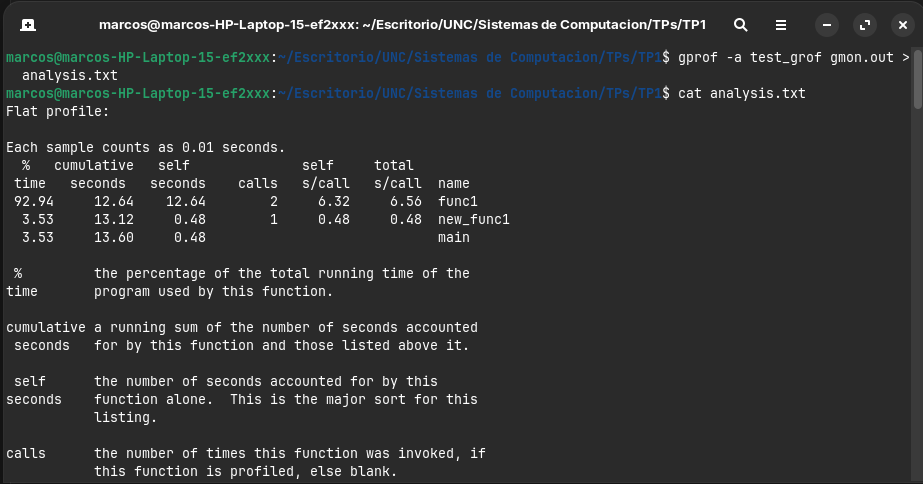
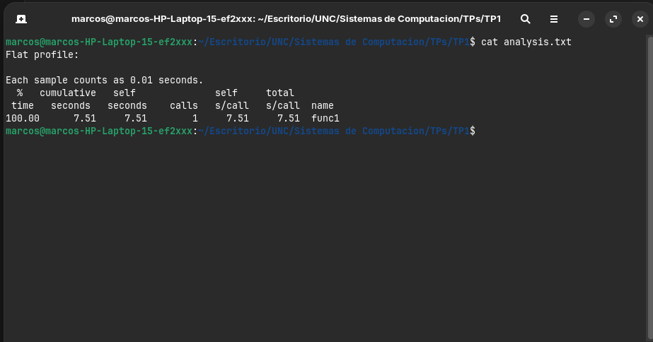
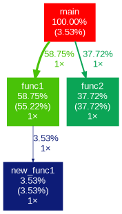

## Parte 1: Uso de benchmarks de terceros para tomar decisiones de hardware

## Parte 2: Benchmark del codigo expuesto en "time profiling"

### Capturas de pantalla de la realización del tutorial descripto

* Paso 1: Creación de perfiles habilitada durante la compilación.

* Paso 2: Ejecución del código.

* Paso 3: Ejecución de la herramienta gprof.

- Archivo analysis.txt sin flags.

- Archivo analysis.txt suprimiendo la impresion de funciones estáticas.

- Archivo analysis.txt sin textos detallados.

- Archivo analysis.txt imprimiendo solo el perfil plano.

- Archivo analysis.txt imprimiendo informacion relacionada unicamente con func1.

## Generación de un gráfico con los datos

- Instalación de gprof2dot y graphviz.

- Comandos utilizados

- Grafico resultante de **gprof2dot**

### Profiling con linux perf

- Ejecución del comando *"sudo perf record"*

- Reporte de la ejecución

## Conclusiones del uso del tiempo de las funciones

A partir del análisis realizado con las herramientas empleadas **gprof**, **gprof2dot** y **perf**, se observa como se distribuye el tiempo de ejecución entre las distintas funciones del programa. 

Primeramente tanto el perfil plano como el grafo de llamadas muestran que la función *func1* es la que mayor tiempo de CPU consume, casi el **55%** del tiempo total de ejecución, esto se debe a que es el bucle más pesado en términos de iteraciónes, ademas llama a la función new_func1, lo que incrementa su tiempo total.

Luego, la función *func2* consume alrededor de un **37%** del tiempo, lo que también es algo significativo, aunque menor a *func1*. Esto se explica porque, si bien posee un bucle intensivo, su carga de trabajo es menor a la de *func1*.

La función *new_func1* representa un porcentaje mucho menor, aproximadamente un **3,5%** del tiempo total, lo cual es consistente con la cantidad de iteraciones que realiza su bucle. Además, al ser llamada únicamente por *func1*, su impacto en el rendimiento es menor.

Finalmente, la función main tiene una incidencia mínima en el tiempo de ejecución, cercana al **3,5%**, ya que su rol se limita a coordinar llamadas a otras funciones sin realizar procesamiento intensivo.

En conclusión, el programa presenta un comportamiento claramente dominado por las funciones que contienen bucles de mayor carga computacional, siendo *func1* el principal cuello de botella. Esto demuestra la utilidad de las herramientas de profiling para identificar qué partes del código impactan más en el rendimiento y orientar posibles optimizaciones.