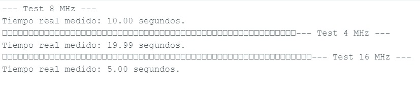
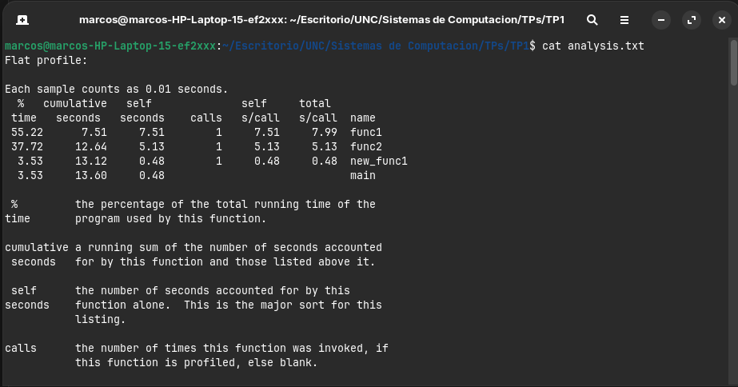
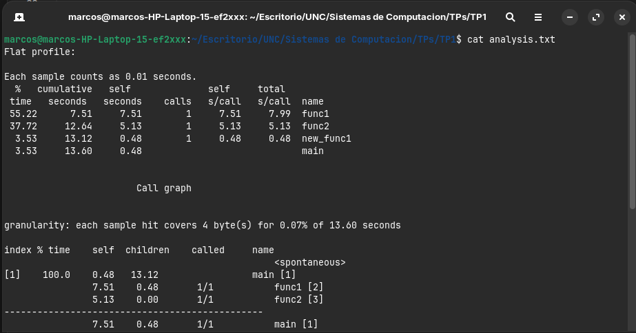
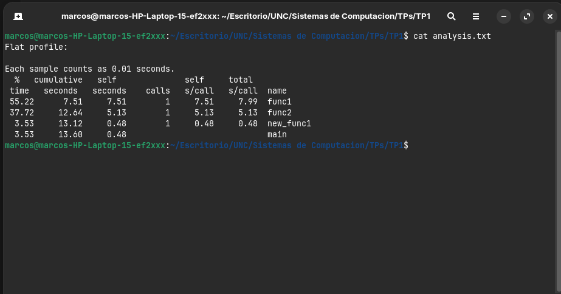
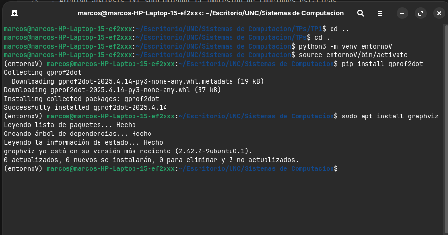
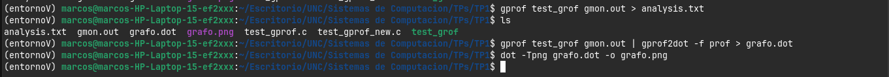
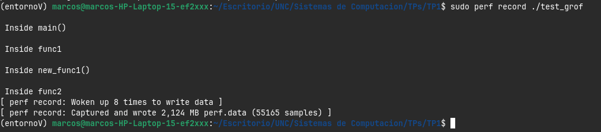
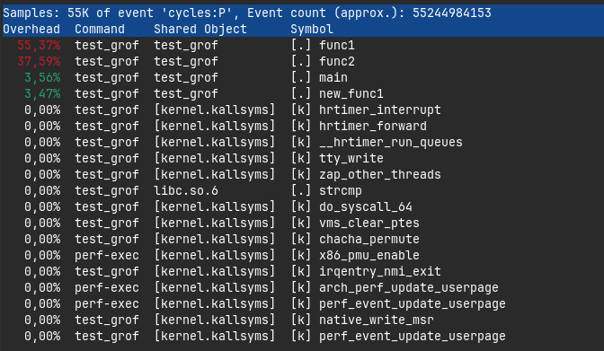

# Introducción

En el siguiente trabajo, se busca:

Evaluar el rendimiento de distintos procesadores.
Aplicar conceptos de benchmarking y análisis de performance.
Comprender qué tipos de pruebas son más útiles según el uso real de una computadora.

Para ello, se analizó el rendimiento de los siguientes procesadores:

- Intel Core i5-13600K
- AMD Ryzen 9 5900X
- AMD Ryzen 9 7950X

Se utilizó como referencia el benchmark de compilación del kernel de Linux disponible en OpenBenchmarking.org.
## Parte 1.1: Uso de benchmarks de terceros para tomar decisiones de hardware
Los benchmarks permiten medir el rendimiento de un sistema y se clasifican en:

- Benchmarks sintéticos
  - Tests controlados.
  - Permiten comparar hardware de forma objetiva.
  - Ejemplo: Cinebench, Geekbench
- Benchmarks reales
  - Simulan uso cotidiano.
  - Reflejan mejor la experiencia del usuario.

Benchmarks según el componente
- CPU: cálculo y multitarea → Cinebench, Geekbench
- GPU: gráficos → 3DMark
- RAM: latencia y velocidad → MemTest86
- Disco: lectura/escritura → CrystalDiskMark
- Red: latencia/ancho de banda → iPerf

### Benchmarks útiles:
Para una persona que estudia computación, los benchmarks más útiles serían:

- Compilación de código (muy importante)
- Rendimiento en multitarea
- Acceso a disco (builds, bases de datos)
- Red (cliente-servidor)
Tareas diarias vs Benchmark representativo

| Tarea diaria                                            | Benchmark representativo             |
| ------------------------------------------------------- | ------------------------------------ |
| Compilar proyectos (C/C++, Java)                        | Compilación del kernel de Linux      |
| Ejecutar múltiples procesos (cliente-servidor, threads) | Cinebench (multi-core)               |
| Manejo de bases de datos                                | Benchmark de disco (CrystalDiskMark) |
| Programación con sockets/red                            | iPerf                                |
| Uso de máquina virtual (Linux en VirtualBox)            | Benchmark de CPU + memoria           |
| Desarrollo con Docker                                   | Benchmark de CPU + disco             |
| Simulaciones matemáticas con Matlab                                  | Benchmark de CPU + disco             |

### Benchmark: Compilación del Kernel de Linux
Se analiza el test: https://openbenchmarking.org/test/pts/build-linux-kernel-1.15.0
Resultados:
| Procesador    | Núcleos/Hilos | Tiempo |
| ------------- | ------------- | ------ |
| Ryzen 9 7950X | 16 / 32       | 53 s   |
| Ryzen 9 5900X | 12 / 24       | 97 s   |
| i5-13600K     | 14 / 20       | 83 s   |

*Cálculo de rendimiento*

Se define: Rendimeinto = 1/tiempo
| Procesador | Rendimiento |
| ---------- | ----------- |
| 7950X      | 0.018       |
| 5900X      | 0.010       |
| i5-13600K  | 0.012       |

*Aceleración*

Tomando como referencia el Ryzen 9 7950X:

- Frente al 5900X: 97/53=1.83x
- Frente al i5-13600K: 83/53=1.56x
Esto significa que el 7950X compila el kernel hasta 83% más rápido que el 5900X.

Análisis
El AMD Ryzen 9 7950X es el más rápido gracias a:
- Mayor cantidad de núcleos
- Mejor paralelismo
El Intel Core i5-13600K tiene buen rendimiento, pero queda en el medio.
El AMD Ryzen 9 5900X es el más lento en este test.

## Parte 1.2: Práctico
Se propone analizar el comportamiento de un microcontrolador que admita cambios en su frecuencia de clock del core. Para ello se utiliza un Arduino Uno R3 que cuenta con una fcclk de 16MHz por defecto, la cual se puede modificar utilizando un prescaler.

Se pone a trabajar al mismo a una frecuencia inicialmente de 8MHz para que realice una tarea (suma de enteros y floats). Al cumplir la tarea imprime el tiempo transcurrido el la terminal serie del IDE de Arduino. Posteriormente se modifica el código para variar la fcclk y se exponen los siguientes resultados:

Como era de esperarse el tiempo en que el microprocesador demora en realizar una tarea es inversamente proporcional a la frecuencia del mismo.
Se adjunta el código de ejemplo:

[text](Practico_Arduino.ino)

## Parte 2: Benchmark del codigo expuesto en "time profiling"

### Capturas de pantalla de la realización del tutorial descripto

* Paso 1: Creación de perfiles habilitada durante la compilación.

* Paso 2: Ejecución del código.

* Paso 3: Ejecución de la herramienta gprof.

- Archivo analysis.txt sin flags.

- Archivo analysis.txt suprimiendo la impresion de funciones estáticas.

- Archivo analysis.txt sin textos detallados.

- Archivo analysis.txt imprimiendo solo el perfil plano.

- Archivo analysis.txt imprimiendo informacion relacionada unicamente con func1.

## Generación de un gráfico con los datos

- Instalación de gprof2dot y graphviz.

- Comandos utilizados

- Grafico resultante de **gprof2dot**

### Profiling con linux perf

- Ejecución del comando *"sudo perf record"*

- Reporte de la ejecución

## Conclusiones del uso del tiempo de las funciones

A partir del análisis realizado con las herramientas empleadas **gprof**, **gprof2dot** y **perf**, se observa como se distribuye el tiempo de ejecución entre las distintas funciones del programa. 

Primeramente tanto el perfil plano como el grafo de llamadas muestran que la función *func1* es la que mayor tiempo de CPU consume, casi el **55%** del tiempo total de ejecución, esto se debe a que es el bucle más pesado en términos de iteraciónes, ademas llama a la función new_func1, lo que incrementa su tiempo total.

Luego, la función *func2* consume alrededor de un **37%** del tiempo, lo que también es algo significativo, aunque menor a *func1*. Esto se explica porque, si bien posee un bucle intensivo, su carga de trabajo es menor a la de *func1*.

La función *new_func1* representa un porcentaje mucho menor, aproximadamente un **3,5%** del tiempo total, lo cual es consistente con la cantidad de iteraciones que realiza su bucle. Además, al ser llamada únicamente por *func1*, su impacto en el rendimiento es menor.

Finalmente, la función main tiene una incidencia mínima en el tiempo de ejecución, cercana al **3,5%**, ya que su rol se limita a coordinar llamadas a otras funciones sin realizar procesamiento intensivo.

En conclusión, el programa presenta un comportamiento claramente dominado por las funciones que contienen bucles de mayor carga computacional, siendo *func1* el principal cuello de botella. Esto demuestra la utilidad de las herramientas de profiling para identificar qué partes del código impactan más en el rendimiento y orientar posibles optimizaciones.
