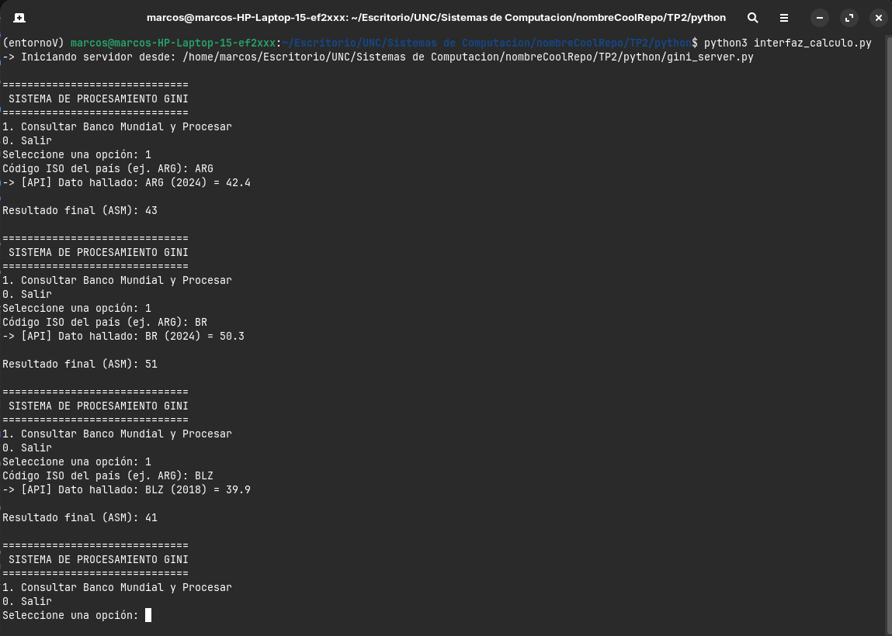
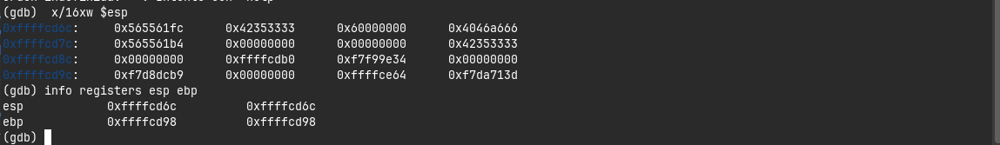
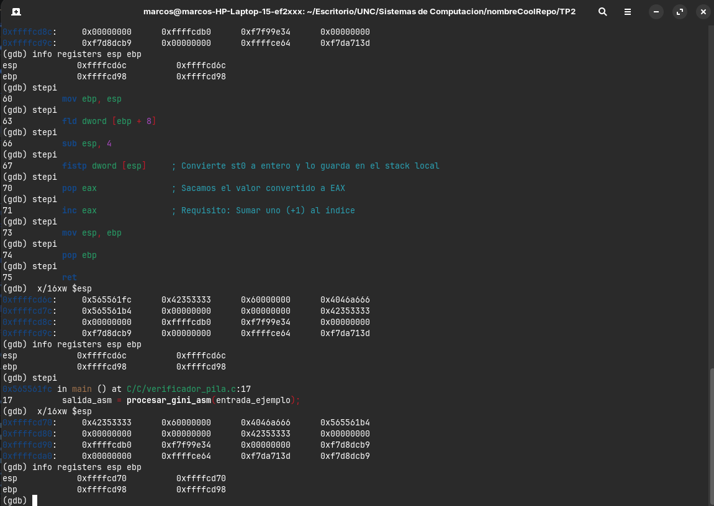

# Trabajo Práctico 2 - Stack frame

## 1. Introducción
Los sistemas compuestos por hardware y software modernos utilizan arquitecturas de capas para el desarrollo de aplicaciones complejas. En las capas superiores se trabaja con lenguajes de alto nivel, que resultan más amigables para el programador, mientras que en la capa inferior interactuamos de manera más cercana con el hardware a través de lenguajes de bajo nivel, como el ensamblador. El presente trabajo práctico ilustra la interacción entre estas capas mediante la implementación de una aplicación que recupera información estadística mundial y la procesa a nivel de procesador. Para que un lenguaje de alto nivel interactúe con el hardware, debe hacerlo a través de lenguajes de bajo nivel utilizando convenciones de llamadas estructuradas.

## 2. Resumen
El proyecto consiste en el desarrollo de una herramienta de software que integra Python, C y lenguaje Ensamblador (x86 de 32 bits). La capa superior recuperará la información del Banco Mundial mediante una API REST. Estos datos son transferidos a un programa escrito en C, el cual actúa como capa intermedia. Finalmente, C convoca rutinas escritas en Ensamblador que reciben los datos mediante la pila (stack), realizan la conversión de valores float a enteros, incrementan el valor en uno (+1) y retornan el resultado a las capas superiores para su visualización.

## 3. Objetivo
* Diseñar e implementar una interfaz funcional que recupere y muestre el índice GINI de un país consultado.
* Emplear rutinas en lenguaje ensamblador para efectuar la conversión de un dato `float` a entero y devolver el índice con un incremento de uno (+1).
* Utilizar de manera estricta el stack (pila) para enviar parámetros y devolver resultados, aplicando las convenciones de llamadas entre lenguajes de alto y bajo nivel.
* Resolver la incompatibilidad intrínseca entre entornos de ejecución Python de 64 bits y bibliotecas compiladas en 32 bits.
* Mostrar como cambia el area de memoria donde se encuentra el stack luego de ejecutar los cálculos haciendo uso de GDB.

## 4. Marco Teórico
* **Arquitectura de Capas y Convenciones de Llamada:** Entender cómo funciona una convención de llamada es fundamental para el desarrollo de sistemas críticos y para profundizar en la interacción entre el software y el hardware. El stack es una región de la memoria RAM que opera bajo el principio LIFO (Last In, First Out). Cada invocación a una función resulta en la creación de un nuevo bloque en el stack, denominado *Stack Frame*. 
* **El Stack Frame en 32 bits:** A diferencia de la convención *System V AMD64 ABI* de 64 bits (donde los primeros parámetros se pasan a través de registros como `%rdi` y `%rsi`), en la arquitectura x86 de 32 bits utilizada en los módulos ASM de este proyecto, los argumentos se envían directamente a través de la pila. El compilador utiliza registros base como `%ebp` (o `%rbp` en 64 bits) como ancla para acceder a las variables locales y parámetros desplazándose por la memoria.
* **Integración 64-bit/32-bit:** Debido a la diferencia arquitectónica, existe una incompatibilidad entre librerías compiladas en 32 bits y un intérprete de Python de 64 bits. Esto se mitiga levantando un servidor local que envuelve el binario en 32 bits, permitiendo la comunicación inter-procesos.

## 5. Explicación del Código Desarrollado

### Capa Superior: Python (Alto Nivel)
Se dividió la lógica en una interfaz de cliente (`interfaz_calculo.py`) y un servidor de 32 bits (`gini_server.py`). 
* **`gini_server.py`**: Utiliza la librería `ctypes` para definir los tipos de datos de los argumentos y retornos de las funciones de C (`argtypes` y `restype`). Extiende la clase `Server32` de `msl.loadlib` para cargar el objeto compartido `libgini.so` compilado en 32 bits.
* **`interfaz_calculo.py`**: Actúa como un `Client64` que solicita operaciones al servidor de 32 bits. Incluye una bitácora y la invocación a la API Rest mediante la biblioteca externa `requests`.

### Capa Intermedia: C
El archivo `procesador_central.c` utiliza prototipos con la palabra reservada `extern` para enlazar dinámicamente las funciones que se encuentran definidas en el módulo de ensamblador. Actúa como un puente de control, permitiendo agregar validaciones y trazas (como llamadas a `printf`) antes de delegar el flujo de ejecución al hardware subyacente.

### Capa Inferior: Ensamblador (x86 - 32 bits)
En `operaciones_gini.asm`, se respeta rigurosamente el diseño del Stack Frame. En la subrutina `procesar_gini_asm`:
1. **Prólogo:** Se establece el *Stack Frame* empujando el puntero base del "caller" a la pila (`push ebp`) y adoptando el puntero actual (`mov ebp, esp`).
2. **Cálculo con la FPU:** Se carga el parámetro flotante en la pila de la unidad de punto flotante usando `fld dword [ebp + 8]`. Luego, se reserva espacio local en la pila tradicional (`sub esp, 4`) para alojar la conversión a entero mediante `fistp dword [esp]`.
3. **Lógica de negocio:** Se extrae el entero convertido al registro de retorno (`pop eax`), y se le suma uno mediante `inc eax` cumpliendo el requerimiento específico.

### Capturas de pantalla
Ejecución del programa completo funcionando

Stack antes de la ejecución de la función sumar_uno_asm

Stack despues de la ejecución de la función sumar_uno_asm

## 6. Paso a paso de ejecución

1. **Instalación de dependencias:** Asegurar que el entorno Linux cuenta con los compiladores multilib para 32 bits y herramientas esenciales ejecutando: 
   `sudo apt install build-essential nasm gcc-multilib g++-multilib`.
2. **Ensamblado:** Compilar el código ASM en un archivo objeto ELF de 32 bits usando NASM: 
   `nasm -f elf32 -g operaciones_gini.asm -o operaciones_gini.o`
3. **Compilación de C y Linkeo dinámico:** Generar la librería compartida `.so` (Shared Object) enlazando C y ASM:
   `gcc -m32 -shared -fPIC -o libgini.so procesador_central.c operaciones_gini.o`
4. **Ejecución del entorno virtual de Python:** Instalar las librerías necesarias mediante pip (`requests` y `msl-loadlib`).
5. **Lanzamiento:** Ejecutar `python3 interfaz_calculo.py`. Ingresar un código de país (Ej: ARG) para interactuar con el Banco Mundial y ver el resultado procesado en Ensamblador.

## 7. Conclusiones
El desarrollo del presente trabajo práctico permitió comprobar empíricamente el funcionamiento de la pila (stack) para el paso de argumentos entre entornos de ejecución mixtos. El uso combinado de C y Assembler nos otorgó control total a nivel de hardware, mientras que Python brindó la versatilidad necesaria para realizar consumo de APIs web modernas de manera eficiente. Finalmente, dominar los conceptos subyacentes del "Stack Frame" demostró ser crucial para el paso seguro de parámetros y la prevención de violaciones de memoria (Segmentation Faults) durante el diseño de la librería dinámica.