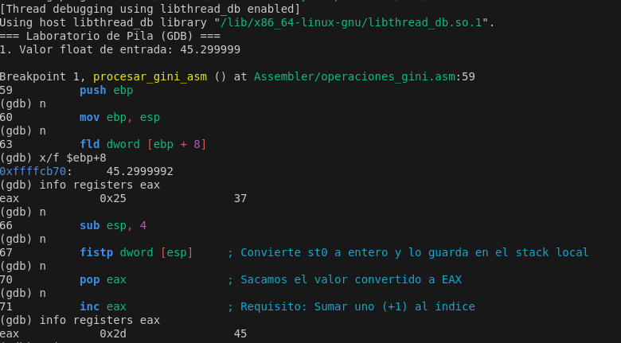

# Informe del Proyecto TP2: Sistema Multicapa para Procesamiento de Datos GINI
Grupo: Electrotonto-y-Computarados 
Materia: Sistemas de Computación

Alumnos: 
- Martina Juri
- Marcos Morán
- Francisco Gomez Neimann
- Cristian Arteaga

## 1. Introducción
El presente proyecto implementa una solución tecnológica integral para el consumo, procesamiento y visualización del Índice de Gini de diferentes países. La arquitectura se basa en un modelo de tres capas que combina la flexibilidad de Python, la eficiencia de C y el control de bajo nivel de Assembler x86.

Un desafío central de este trabajo fue la interoperabilidad multi-arquitectura: ejecutar código de 32 bits (Assembler/C) dentro de un entorno moderno de 64 bits (Python 3.12 en Linux). Esto se resolvió mediante un puente cliente-servidor utilizando la librería msl-loadlib.

## 2. Objetivos
Desarrollar rutinas matemáticas de punto flotante en Assembler x86 utilizando la FPU (Floating Point Unit).

Implementar un Wrapper en C para la gestión de tipos de datos y enlace de librerías dinámicas (.so).

Consumir datos reales de la API del Banco Mundial mediante Python.

Documentar el comportamiento de la Pila (Stack) y los registros del procesador durante la transición entre lenguajes.

## 3. Arquitectura del Sistema
El software se organiza en una estructura modular para facilitar el mantenimiento y la colaboración mediante Git:

Plaintext
TP2/
├── Assembler/         # Lógica de bajo nivel (operaciones_gini.asm)
├── C/                 # Interfaz intermedia (procesador_central.c, verificador_pila.c)
├── python/            # Capa de usuario (interfaz, api, servidor 32-bit)
├── libgini.so         # Librería compartida (ELF 32-bit)
├── Makefile           # Automatización de la compilación
└── INSTALL.md         # Guía de despliegue y dependencias
## 4. Descripción de las Capas
### 4.1. Capa de Bajo Nivel (Assembler)
Se implementó el archivo operaciones_gini.asm utilizando instrucciones de la FPU de Intel. La función principal, procesar_gini_asm, realiza las siguientes tareas:

Recibe un parámetro float mediante el Stack ([ebp + 8]).

Carga el valor en el registro st0 de la FPU (fld).

Convierte el valor flotante a entero truncado y lo guarda en la pila local (fistp).

Mueve el resultado al registro EAX y le suma una unidad (inc eax) según el requerimiento del TP.

### 4.2. Capa Intermedia (C)
El archivo procesador_central.c actúa como puente. Declara las funciones de Assembler como extern y las expone para ser llamadas desde Python. Se compiló utilizando el flag -m32 para asegurar la compatibilidad con el código de 32 bits y -fPIC para generar código independiente de posición.

### 4.3. Capa de Aplicación (Python)
Cliente (64-bit): Gestiona la interfaz de usuario y la conexión con la API del Banco Mundial.

Servidor (32-bit): Carga la librería libgini.so mediante ctypes. Este componente es vital ya que Python de 64 bits no puede cargar directamente binarios de 32 bits por restricciones del sistema operativo.

## 5. Análisis del Stack y Depuración (Evidencia GDB)
Para verificar el correcto funcionamiento, se utilizó GDB sobre el ejecutable verificador. En la siguiente captura se observa el flujo de datos:

Análisis de la captura:

Línea 63 (fld): Se observa que en la dirección 0xffffcb70 ($ebp+8) reside el valor 45.2999992, que es el índice Gini enviado desde C.

Línea 67 (fistp): El procesador convierte el flotante a entero (45).

Línea 71 (inc eax): El registro EAX pasa de 0x2d (45 en decimal) a ser incrementado, finalizando con el valor esperado.

Registros: Se confirmó que EAX contenía 45 justo antes del incremento, validando que el valor fue recuperado correctamente desde la pila mediante pop eax.

## 6. Resolución de Problemas (Lecciones Aprendidas)
Durante el desarrollo, se enfrentaron y resolvieron los siguientes obstáculos técnicos:

Falta de librerías de 32 bits: Se debió habilitar la arquitectura i386 en Linux y cargar zlib1g:i386 para permitir que el servidor de msl-loadlib funcionara.

Entornos Protegidos: Se implementó un entorno virtual (venv) para gestionar las dependencias de Python (requests, msl-loadlib) cumpliendo con las normativas PEP 668 de sistemas Linux modernos.

Manejo de Path: Se ajustó el servidor de 32 bits para utilizar rutas absolutas, evitando errores de importación al ejecutar desde diferentes directorios.

## 7. Conclusión
El proyecto permitió comprender profundamente cómo interactúan los lenguajes de alto y bajo nivel. La implementación exitosa del puente 64/32 bits demuestra que es posible modernizar sistemas legados o utilizar instrucciones específicas de hardware (como la FPU de 32 bits) dentro de aplicaciones modernas. La correcta gestión de la pila y el conocimiento de las convenciones de llamada (cdecl) resultaron fundamentales para la estabilidad del sistema.

## Anexo: Guía de Uso Rápido
Compilar: make

Activar entorno: source venv/bin/activate

Ejecutar: python3 python/interfaz_calculo.py