# Trabajo Práctico 3 — Modo Protegido en x86

**Materia:** Sistemas de Computación

**Alumnos:**
- Martina Juri
- Marcos Morán
- Francisco Gomez Neimann
- Cristian Eduardo Arteaga Barrera

**Vínculo al repositorio:** 
https://github.com/MMoran2001/Electrotonto-y-Computarados

---

## Introducción

En este trabajo práctico se desarrollaron dos experiencias prácticas y una teórica relacionadas 
con la arquitectura x86 a bajo nivel:

1. **Desafío EUFI y Coreboot:** El arranque moderno con UEFI sumó funciones útiles, pero introdujo vulnerabilidades graves e invisibles para el sistema operativo. En esta sección analizaremos los riesgos de UEFI y del subsistema oculto Intel CSME, y veremos cómo Coreboot propone recuperar el control del hardware usando un firmware minimalista y de código abierto.
2. **Desafío Linker:** compilación y ejecución de un bootloader simple usando un 
   script de linker, con análisis de la imagen binaria resultante.
3. **Desafío Final:** implementación de un bootloader en assembler, sin uso de macros, 
   capaz de realizar la transición del procesador desde **modo real** hacia 
   **modo protegido**, con verificación de protección de memoria.

Ambos programas fueron compilados en Ubuntu y ejecutados en QEMU.

---
# Parte 1 — Desafío UEFI y Coreboot

## 1.1 ¿Qué es UEFI?

UEFI (Unified Extensible Firmware Interface) es el estándar moderno de firmware 
que reemplaza a la BIOS tradicional. Es lo primero que ejecuta un sistema cuando 
se enciende, antes de que cargue el sistema operativo.

A diferencia de la BIOS, UEFI está escrito en C, tiene soporte para interfaces 
gráficas, maneja discos de más de 2TB mediante el esquema de particiones GPT, 
implementa Secure Boot para verificar la integridad del bootloader, y posee 
capacidades de red antes de que el sistema operativo cargue. Su complejidad es 
tal que puede considerarse un sistema operativo en sí mismo, con su propio 
sistema de archivos (ESP), drivers y aplicaciones.

### Ejemplo de función UEFI

Una aplicación UEFI puede invocar servicios del firmware a través de la tabla 
de Boot Services. Por ejemplo, para reservar memoria dinámica:

```c
EFI_STATUS status;
VOID *buffer;

status = gBS->AllocatePool(
    EfiLoaderData,       // tipo de memoria
    1024,                // tamaño en bytes
    &buffer              // puntero al buffer resultante
);
```

Esta función es equivalente a un `malloc` en C estándar, pero dentro del 
entorno UEFI antes de que el sistema operativo tome el control.

---

## 1.2 Bugs conocidos de UEFI

La complejidad de UEFI lo hace propenso a vulnerabilidades graves. Lo más 
peligroso es que el malware que explota estas vulnerabilidades puede instalarse 
por debajo del sistema operativo, siendo casi imposible de detectar o eliminar 
con herramientas convencionales.

Algunas vulnerabilidades destacadas son:

**BootHole (2020):** vulnerabilidad en el bootloader GRUB2 que permitía saltear 
el mecanismo de Secure Boot. Un atacante podía ejecutar código arbitrario durante 
el arranque incluso con Secure Boot activo.

**LogoFAIL (2023):** vulnerabilidad en el parser de imágenes que los fabricantes 
usan para mostrar el logo durante el arranque. Un atacante podía reemplazar esa 
imagen con una versión maliciosa que ejecutara código antes de que el sistema 
operativo cargara, sin ser detectado por Secure Boot.

**PixieFail:** conjunto de vulnerabilidades en la implementación del stack de 
red de UEFI (PXE), que permitía realizar ataques remotos sobre equipos durante 
el proceso de arranque por red, antes de que el sistema operativo estuviera activo.

---

## 1.3 ¿Qué es CSME?

CSME (Converged Security and Management Engine) es un subsistema autónomo 
integrado en los procesadores Intel modernos. Funciona como una computadora 
independiente dentro del procesador principal: tiene su propio núcleo de 
procesamiento, memoria dedicada y sistema operativo propio basado en MINIX.

Su característica más notable es que opera de forma completamente independiente 
al procesador principal y al sistema operativo del usuario. Continúa funcionando 
incluso cuando el equipo está aparentemente apagado, siempre que haya 
alimentación eléctrica disponible.

Sus funciones oficiales incluyen gestión remota empresarial, verificación de 
integridad del firmware, protección de contenido DRM y autenticación segura. 
Sin embargo, dado que tiene acceso directo a memoria, almacenamiento y 
dispositivos de red, representa una superficie de ataque significativa: 
una vulnerabilidad en el CSME puede comprometer completamente el sistema 
sin que el usuario ni el sistema operativo puedan detectarlo.

---

## 1.4 ¿Qué es Intel MEBx?

Intel MEBx (Management Engine BIOS Extension) es la interfaz de configuración 
del CSME accesible durante el arranque del sistema, generalmente mediante la 
combinación de teclas Ctrl+P. Desde esta interfaz se pueden configurar las 
funciones de administración remota del hardware, incluyendo Intel AMT 
(Active Management Technology).

En entornos empresariales, AMT permite a los administradores de sistemas 
encender, apagar, reiniciar o reinstalar el sistema operativo de equipos 
de forma remota, independientemente del estado del sistema operativo instalado.

El principal riesgo de seguridad asociado a MEBx es que muchos equipos 
se entregan con la contraseña por defecto (`admin`) sin cambiar. Si un 
atacante con acceso físico breve al equipo habilita AMT con credenciales 
conocidas, puede obtener control remoto total del mismo desde cualquier 
punto de la red, incluso si el sistema operativo es reinstalado posteriormente.

---

## 1.5 ¿Qué es coreboot?

Coreboot es un proyecto de firmware libre y de código abierto diseñado para 
reemplazar la BIOS o UEFI propietaria. Su filosofía de diseño es realizar 
únicamente la inicialización mínima e indispensable del hardware y luego 
transferir el control a un payload, que puede ser GRUB, SeaBIOS, u otro 
cargador de sistema operativo.

### Productos que utilizan coreboot

- **Chromebooks de Google:** prácticamente todos los modelos utilizan coreboot 
  como firmware base.
- **Laptops de System76:** fabricante de equipos orientados a Linux que adoptó 
  coreboot para mayor transparencia y control.
- **Dispositivos Purism Librem:** línea de laptops enfocada en privacidad que 
  utiliza coreboot junto con neutralización del ME de Intel.
- **Routers con OpenWRT:** diversos modelos de routers utilizan coreboot como 
  base del firmware.

### Ventajas de coreboot

- **Código abierto y auditable:** cualquier persona puede inspeccionar el código 
  en busca de vulnerabilidades o backdoors, a diferencia del firmware propietario.
- **Arranque más rápido:** al eliminar la inicialización innecesaria de UEFI, 
  el tiempo de arranque se reduce significativamente.
- **Menor superficie de ataque:** su simplicidad implica menos código y por lo 
  tanto menos vectores de ataque potenciales.
- **Sin subsistemas ocultos:** a diferencia de UEFI, no incorpora componentes 
  de gestión remota ni servicios que operen sin conocimiento del usuario.
- **Mayor control del hardware:** permite al usuario y al sistema operativo 
  tener control real sobre el hardware desde el primer momento del arranque.

---
# Parte 2 — Desafío Linker

## 2.1 ¿Qué es un linker y qué hace?

Un linker (enlazador) es una herramienta del proceso de compilación que toma uno 
o más archivos objeto (.o) generados por el ensamblador o compilador, y los combina 
para producir un archivo ejecutable final. Sus tareas principales son:

- **Resolución de símbolos:** conecta las referencias a funciones y variables 
  definidas en distintos archivos objeto.
- **Reubicación:** ajusta las direcciones de memoria de instrucciones y datos según 
  la ubicación final que tendrán en memoria.
- **Generación del binario final:** produce el archivo de salida en el formato 
  indicado (en nuestro caso, binario puro con `--oformat binary`).

En el contexto de este TP, el linker toma el archivo objeto `main.o` generado por 
el ensamblador GAS y produce la imagen binaria `main.img` lista para ser ejecutada 
directamente por la BIOS.

---

## 2.2 ¿Qué es la dirección 0x7C00 y por qué es necesaria?

La dirección `0x7C00` es la ubicación fija en memoria donde la BIOS carga el sector 
de arranque (bootloader) al iniciar el sistema. Esta convención existe desde los 
primeros IBM PC y se mantiene por compatibilidad.

Es necesario indicársela al linker porque este debe calcular las direcciones absolutas 
de todos los símbolos del programa. Por ejemplo, en nuestro código el label `msg` 
apunta al string "hello world". Si el linker no sabe que el programa va a estar en 
`0x7C00`, calculará direcciones incorrectas y el programa fallará al intentar acceder 
al string.

En nuestro caso, el linker calculó que `msg` queda en `0x7C0F` 
(`0x7C00 + 0x0F = 0x7C0F`), lo cual se verificó en la comparación objdump vs hd.

---

## 2.3 ¿Para qué se utiliza la opción --oformat binary?

La opción `--oformat binary` le indica al linker que el archivo de salida debe ser 
un binario puro, es decir, únicamente los bytes del programa sin ningún encabezado 
ni metadata adicional.

Sin esta opción, el linker generaría por defecto un archivo en formato ELF 
(Executable and Linkable Format), que incluye encabezados, tablas de símbolos y 
otras estructuras que el sistema operativo usa para cargar el programa. Sin embargo, 
la BIOS no entiende ELF — ella simplemente lee los primeros 512 bytes del disco y 
los ejecuta directamente. Por eso es imprescindible usar `--oformat binary` para 
obtener una imagen que la BIOS pueda ejecutar.

---

## 2.4 Código fuente

Se trabajó con los archivos de la carpeta `01HelloWorld` del repositorio oficial. 
El código fuente `main.S` implementa un bootloader en assembler de 16 bits que 
muestra el mensaje "hello world" en pantalla utilizando la interrupción de BIOS 
`int 0x10`:

```asm
.code16
    mov $msg, %si
    mov $0x0e, %ah
loop:
    lodsb
    or %al, %al
    jz halt
    int $0x10
    jmp loop
halt:
    hlt
msg:
    .asciz "hello world"
```

El script del linker `link.ld` define la estructura del binario final:

```ld
SECTIONS
{
    . = 0x7c00;
    .text :
    {
        __start = .;
        *(.text)
        . = 0x1FE;
        SHORT(0xAA55)
    }
}
```

---

## 2.5 Procedimiento de compilación

Se clonó el repositorio oficial del TP e inicializaron los submódulos:

```bash
git clone https://gitlab.com/sistemas-de-computacion-2021/protected-mode-sdc
cd protected-mode-sdc
git submodule update --init --recursive
```

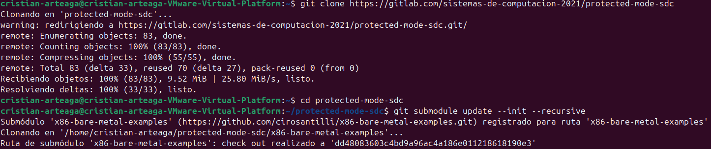

Luego se compiló exitosamente el programa:

```bash
cd 01HelloWorld
as -g -o main.o main.S
ld --oformat binary -o main.img -T link.ld main.o
```

---

## 2.6 Ejecución en QEMU

```bash
qemu-system-x86_64 -hda main.img
```

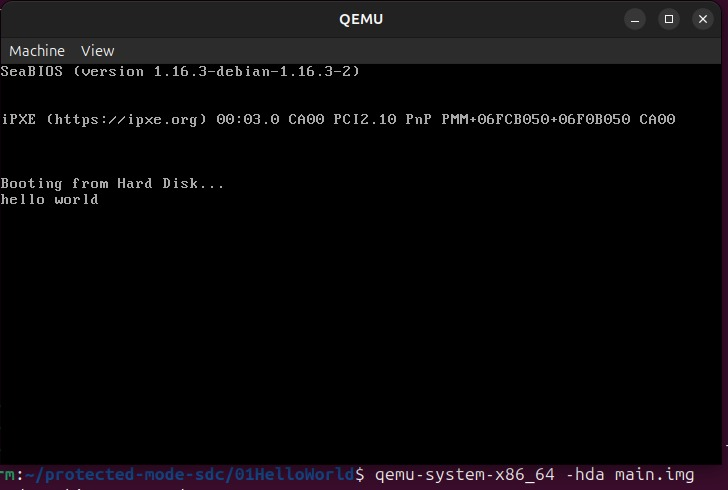

La ejecución en QEMU fue exitosa, mostrando el mensaje "hello world" en pantalla 
luego del mensaje "Booting from Hard Disk...".

---

## 2.7 Comparación objdump vs hd

Se compararon las salidas de ambas herramientas para verificar la ubicación del 
programa dentro de la imagen:

```bash
objdump -b binary -m i8086 -D main.img | head -30
hd main.img | head -20
```

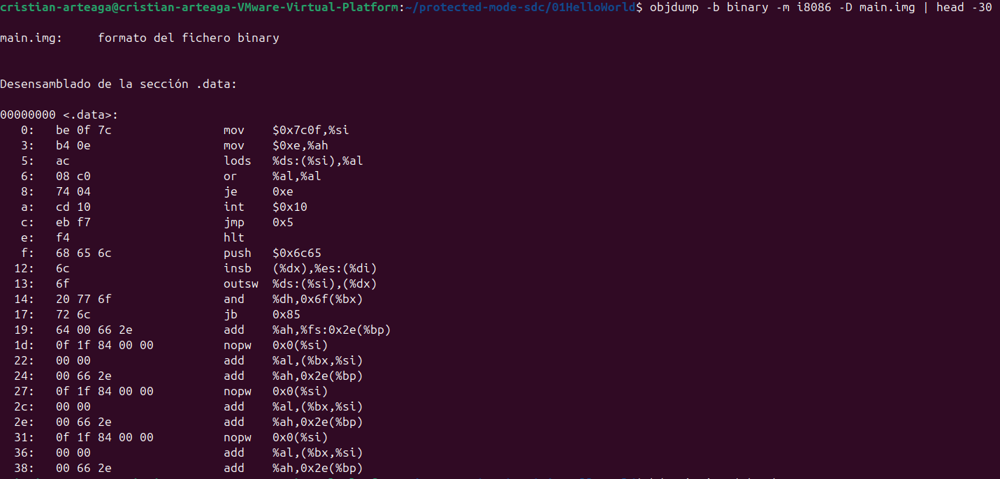

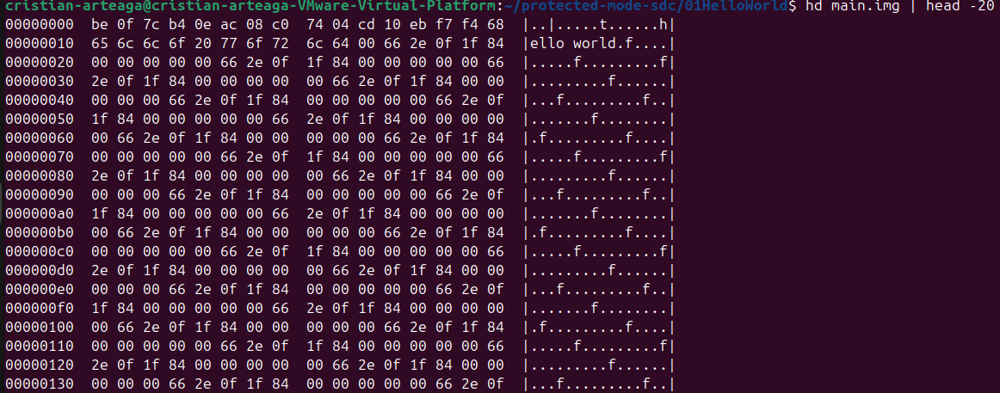

**Análisis:**

Ambas herramientas muestran el mismo contenido desde perspectivas distintas:

- `hd` muestra los bytes crudos en hexadecimal tal como están en el archivo 
  binario, sin ninguna interpretación.
- `objdump` toma esos mismos bytes y los desensambla, interpretándolos como 
  instrucciones x86.

Los puntos verificados fueron:

- **El programa comienza en el offset 0x00:** el primer byte `0xBE` corresponde 
  a la instrucción `mov $0x7c0f, %si`, confirmando que el código fue colocado 
  al inicio del sector.
- **El string "hello world" está en el offset 0x0F:** los bytes 
  `68 65 6c 6c 6f 20 77 6f 72 6c 64` corresponden exactamente a los caracteres 
  ASCII de "hello world". El linker calculó correctamente su dirección como 
  `0x7C0F` (`0x7C00 + 0x0F`).
- **La firma MBR está al final:** `hd` muestra `55 AA` en el offset `0x1FE` 
  (bytes 510-511), confirmando que el linker colocó correctamente la firma de 
  booteo requerida por la BIOS.

---

## 2.8 Grabación en pendrive y prueba en hardware real

La imagen fue grabada en un pendrive Kingston DT 101 G2 utilizando el comando:

```bash
sudo dd if=main.img of=/dev/sdb bs=512 count=1
```

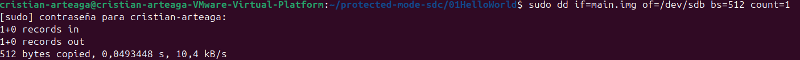

Al bootear desde el pendrive en una PC real (Asus VivoBook con Windows 11), 
la BIOS reconoció correctamente el sector de arranque y ejecutó el bootloader. 
Sin embargo, la interrupción de BIOS `int 0x10` utilizada para mostrar texto 
no funcionó en el hardware moderno debido a las restricciones del firmware UEFI, 
que en equipos modernos no implementa completamente las interrupciones de BIOS 
legacy en el modo de compatibilidad. El comportamiento correcto fue verificado 
exitosamente en QEMU.

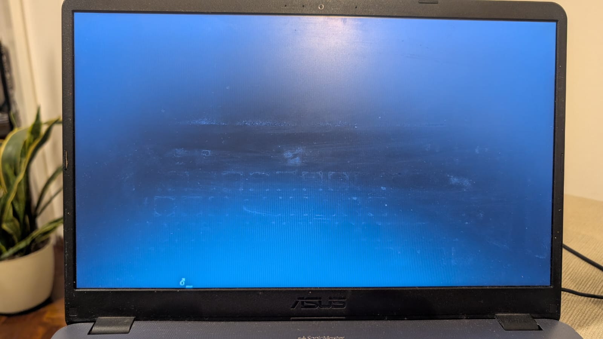

---

# Parte 3 — Desafío Final: Bootloader con Modo Protegido

## 3.1 Introducción

En esta sección se desarrolló un bootloader en assembler, sin uso de macros, 
capaz de realizar la transición del procesador desde **modo real** hacia 
**modo protegido**. El objetivo principal fue:

- implementar el cambio a modo protegido,
- definir una **GDT (Global Descriptor Table)** con dos descriptores distintos,
- utilizar segmentos de memoria diferenciados para **código** y **datos**,
- modificar los permisos del segmento de datos para convertirlo en **solo lectura**,
- provocar una excepción al intentar escribir sobre dicho segmento,
- verificar el comportamiento mediante **QEMU** y **GDB**.

---

## 3.2 Código Assembly completo

```nasm
; Bootloader x86 - transición de modo real a modo protegido
bits 16
org 0x7C00

boot_start:
    cli
    lgdt [descriptor_gdt]
    mov eax, cr0
    or eax, 0x1
    mov cr0, eax
    jmp SEL_CODE:pm_entry

bits 32
pm_entry:
    mov ax, SEL_DATA
    mov ds, ax
    mov es, ax
    mov ss, ax
    mov fs, ax
    mov gs, ax
    mov esp, stack_base
    mov edi, 0x00100000
    mov eax, 0x12345678
    mov [edi], eax
    mov edi, 0xB8000
    mov ah, 0x0F
    mov al, 'O'
    mov [edi], ax
    add edi, 2
    mov al, 'K'
    mov [edi], ax

loop_halt:
    hlt
    jmp loop_halt

descriptor_gdt:
    dw gdt_finish - gdt_begin - 1
    dd gdt_begin

align 8
gdt_begin:
null_descriptor:
    dq 0x0000000000000000

code_descriptor:
    dw 0xFFFF
    dw 0x0000
    db 0x00
    db 0x9A
    db 0xCF
    db 0x00

data_descriptor:
    dw 0xFFFF
    dw 0x0000
    db 0x10
    db 0x90
    db 0xCF
    db 0x00

gdt_finish:

SEL_CODE equ code_descriptor - gdt_begin
SEL_DATA equ data_descriptor - gdt_begin
stack_base equ 0x90000

times 510-($-$$) db 0
dw 0xAA55
```

El código no utiliza macros. Los aspectos más importantes son:

- Comienza en 16 bits con `bits 16` y `org 0x7C00`
- Define una GDT con tres entradas: descriptor nulo, segmento de código y 
  segmento de datos de solo lectura
- Realiza la transición a modo protegido siguiendo la secuencia estándar
- Intenta escribir en el segmento de datos de solo lectura para provocar una 
  excepción `#GP`
- Termina con un loop `hlt` para detener el procesador

---

## 3.3 Descriptores de memoria

Se implementaron dos descriptores dentro de la GDT con espacios de memoria 
diferenciados:

**Segmento de código:**
- base: `0x00000000`
- límite: `0xFFFFF`
- byte de acceso: `0x9A` (presente, ring 0, ejecutable, legible)

**Segmento de datos (solo lectura):**
- base: `0x00100000` (1 MB) — espacio de memoria diferenciado del segmento de código
- límite: `0xFFFFF`
- byte de acceso: `0x90` (presente, ring 0, solo lectura)

La base del segmento de datos se establece mediante el byte `db 0x10` en el 
descriptor, que corresponde a los bits 16-23 de la dirección base, resultando 
en `0x00100000`. Esto ubica el segmento de datos a partir del primer megabyte 
de memoria, separado físicamente del segmento de código que comienza en `0x00000000`.

La diferencia entre ambos segmentos es doble:
- **Separación física:** apuntan a regiones distintas de memoria
- **Permisos:** el segmento de datos tiene el bit W (writable) en 0, 
  convirtiéndolo en solo lectura

Cualquier intento de escritura sobre el segmento de datos genera una 
excepción `#GP`.

---

## 3.4 Compilación

```bash
nasm -f bin bootloader.asm -o bootloader.img
ls -l bootloader.img
```
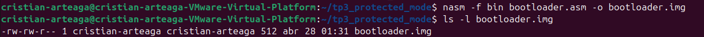


La imagen resultante pesa exactamente **512 bytes**, correspondiente al tamaño 
de un sector de arranque MBR.

---

## 3.5 Pasaje a modo protegido

Para realizar la transición se siguieron los pasos estándar:

1. Deshabilitación de interrupciones con `cli`
2. Carga de la GDT mediante `lgdt`
3. Activación del bit PE (Protection Enable) en `CR0`
4. Ejecución de un far jump para actualizar `CS`
5. Recarga de los registros de segmento de datos

```asm
cli
lgdt [descriptor_gdt]
mov eax, cr0
or eax, 0x1
mov cr0, eax
jmp SEL_CODE:pm_entry
```

---

## 3.6 ¿Con qué valor se cargan los registros de segmento y por qué?

En modo protegido los registros de segmento no contienen direcciones de memoria 
como en modo real, sino **selectores**. Un selector es un índice que apunta a 
una entrada de la GDT y tiene el siguiente formato:

- **Bits 15-3:** índice en la GDT
- **Bit 2:** indicador TI (0 = GDT, 1 = LDT)
- **Bits 1-0:** nivel de privilegio RPL

Como cada entrada de la GDT ocupa exactamente **8 bytes**, los valores de los 
selectores se calculan multiplicando el índice por 8:

- `CS = 0x08` → índice 1 × 8 = 8 → apunta al descriptor de código
- `DS = 0x10` → índice 2 × 8 = 16 = 0x10 → apunta al descriptor de datos

---

## 3.7 Ejecución en QEMU — Estado en modo protegido

```bash
qemu-system-i386 -fda bootloader.img -boot a -monitor stdio
```

Una vez ejecutado, se verificó el estado del procesador con el comando 
`info registers` en el monitor de QEMU:
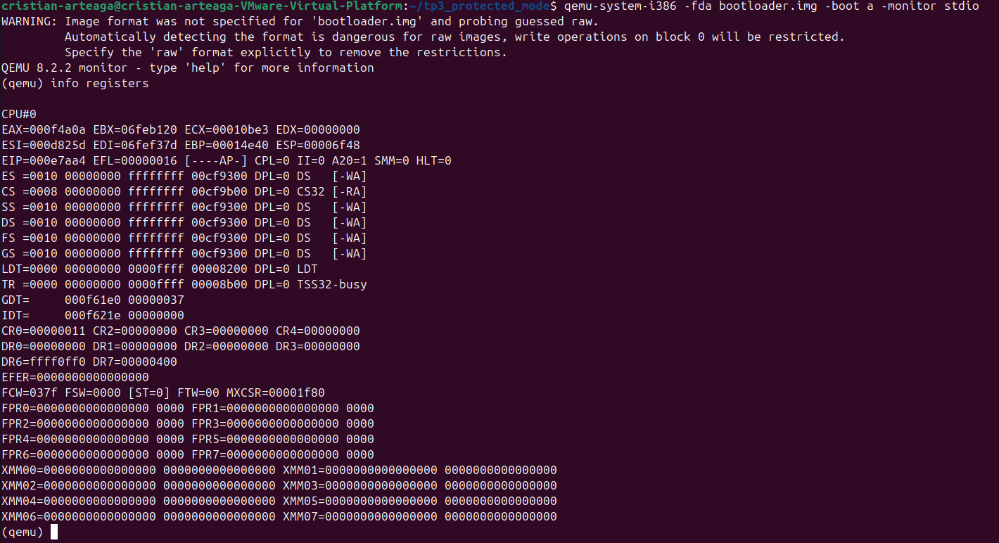


Los valores observados confirman la transición exitosa:

```
CR0 = 0x00000011    → bit PE = 1, modo protegido activo
CS  = 0x0008        → selector de código (índice 1 × 8)
DS  = 0x0010        → selector de datos (índice 2 × 8)
SS  = 0x0010
ES  = 0x0010
FS  = 0x0010
GS  = 0x0010
GDT = 000f61e0 00000037 → GDT cargada correctamente
```

---

## 3.8 Verificación de protección de memoria

Se inspeccionó la dirección `0x00100000` mediante el monitor de QEMU:

```
x /4xw 0x00100000
```

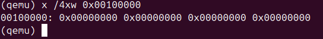

```
00100000: 0x00000000 0x00000000 0x00000000 0x00000000
```

La memoria permaneció en cero, confirmando que la escritura fue bloqueada 
por la protección del segmento de datos de solo lectura.

---

## 3.9 Log de excepciones

Se ejecutó QEMU con logging de interrupciones para registrar las excepciones 
generadas:

```bash
qemu-system-i386 -fda bootloader.img -boot a -monitor stdio -d int 2>qemu_log.txt
cat qemu_log.txt | grep -A2 "v="
```
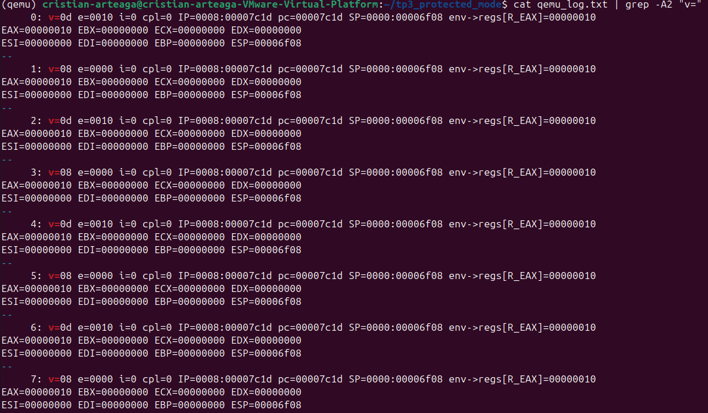

La secuencia observada fue:

```
0: v=0d → #GP (General Protection Fault)
1: v=08 → #DF (Double Fault)
2: v=0d → #GP
3: v=08 → #DF
...
IP = 0008:00007c1d → instrucción mov [edi], eax
```

La secuencia completa fue:
1. `mov [edi], eax` intenta escribir en el segmento de solo lectura
2. El procesador genera `#GP` (excepción 0x0D)
3. No existe IDT configurada para manejar el `#GP`
4. El procesador genera `#DF` (excepción 0x08)
5. Tampoco existe handler para el `#DF`
6. Ocurre un **triple fault** que reinicia el procesador

---

## 3.10 Verificación con GDB

Se conectó GDB a QEMU para verificar el comportamiento paso a paso.

### Estado inicial — Modo Real

Se colocó un breakpoint en `0x7C00` para observar el estado inicial:

```bash
gdb -ex "target remote localhost:1234" \
    -ex "set architecture i8086" \
    -ex "break *0x7c00" \
    -ex "continue"
```
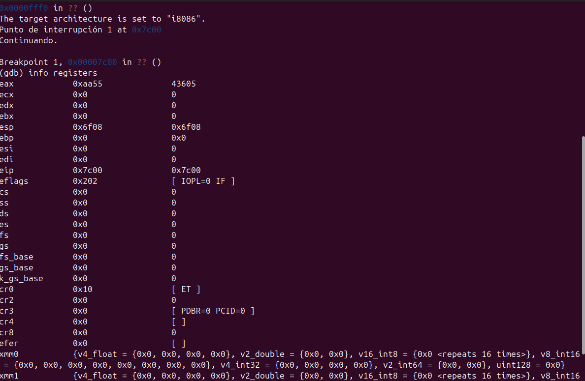

```
eip    = 0x7c00   → inicio del bootloader
cr0    = 0x10     → bit PE = 0, procesador en modo real
cs     = 0x0000
ds     = 0x0000
eflags = 0x202    → interrupciones habilitadas (IF=1)
```

### Estado previo a la excepción

Se colocó un segundo breakpoint en `0x7C1D`, correspondiente a la instrucción 
`mov [edi], eax`:

```
break *0x7c1d
continue
info registers
```

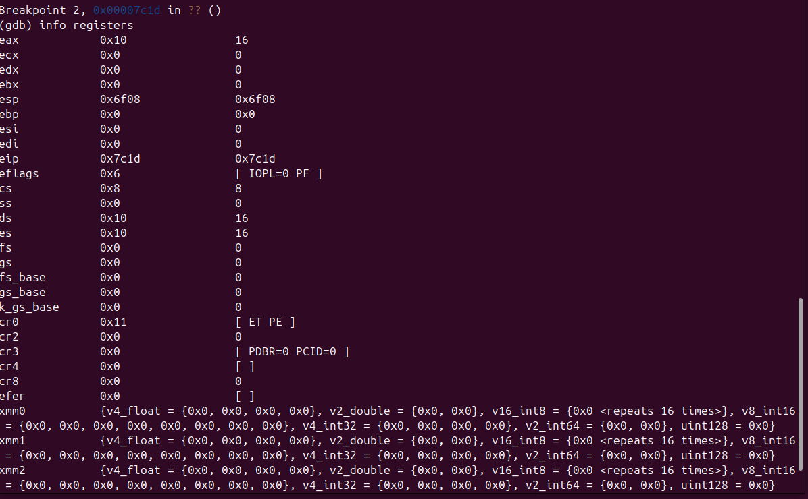

```
eip = 0x7c1d       → instrucción mov [edi], eax (aún no ejecutada)
cr0 = 0x11 [ET PE] → modo protegido activo
cs  = 0x08         → selector de código
ds  = 0x10         → selector de datos (solo lectura)
eax = 0x10         → valor que se intentará escribir
```

### Estado posterior a la excepción

Se ejecutó `stepi` para avanzar una instrucción y disparar la excepción:

```
stepi
info registers
```
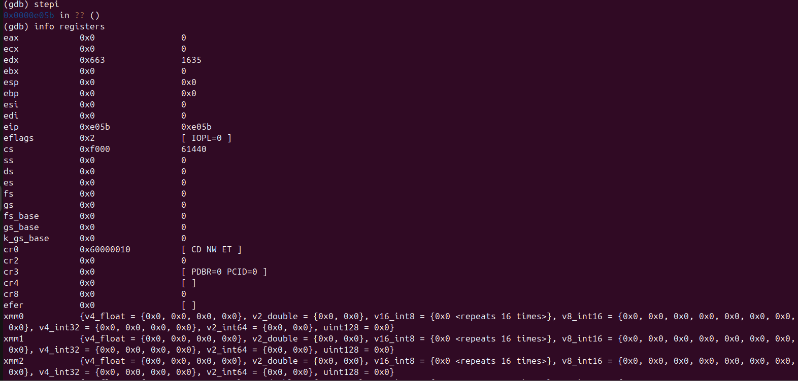


```
eip = 0xe05b        → saltó a código de la BIOS
cs  = 0xf000        → segmento de la BIOS
cr0 = 0x60000010    → bit PE desapareció, procesador reiniciado
esp = 0x0           → stack reseteado
```

El control saltó a la BIOS tras el triple fault, confirmando que la protección 
de memoria funcionó correctamente.

---

## Conclusiones

### Desafío EUFI y Coreboot

La complejidad de UEFI e Intel CSME evidencia que la industria actual prioriza sumar funciones por sobre la seguridad, dejando los equipos expuestos a ataques de bajo nivel. Coreboot nos demuestra que la mejor alternativa es la simplicidad: inicializar solo lo indispensable y pasarle el mando rápido al sistema operativo. En definitiva, adoptar un firmware de código abierto es clave para recuperar el control real de nuestro hardware.

### Desafío Linker

Se verificó experimentalmente el rol del linker en la construcción de un 
bootloader funcional. La dirección `0x7C00` es fundamental para que el linker 
calcule correctamente las referencias a símbolos dentro del programa. La opción 
`--oformat binary` es indispensable para generar una imagen que la BIOS pueda 
ejecutar directamente. La comparación entre `objdump` y `hd` permitió verificar 
que tanto el código como los datos quedaron ubicados en las posiciones correctas 
dentro de la imagen.

### Desafío Final

Se logró implementar exitosamente el pasaje a modo protegido verificando:

- activación del bit PE en CR0 (`CR0 = 0x11`)
- carga correcta de la GDT
- segmentos de código y datos en espacios de memoria diferenciados 
  (base `0x00000000` y `0x00100000` respectivamente)
- selectores con valores correctos (`CS=0x08`, `DS=0x10`)
- protección de escritura en segmento read-only verificada mediante 
  inspección de memoria
- generación de `#GP` ante el intento de escritura inválido
- escalamiento a `#DF` por ausencia de IDT
- reinicio del procesador por triple fault

El comportamiento observado en QEMU y verificado paso a paso con GDB coincide 
completamente con la teoría de la arquitectura x86.
