# Informe – Entorno UEFI, Desarrollo y Análisis de Seguridad

**Materia:** Sistemas de Computación
**Alumnos:** 
- Martina Juri
- Marcos Morán
- Francisco Gomez Neimann
- Cristian Eduardo Arteaga Barrera

**Vínculo al repositorio:** 
https://github.com/MMoran2001/Electrotonto-y-Computarados

**Trabajo Práctico:** TP3.a - UEFI

---

## 1. Introducción

El presente trabajo tiene como objetivo comprender la arquitectura de la Interfaz de Firmware Extensible Unificada (UEFI), analizando su funcionamiento como entorno previo al sistema operativo (pre-OS).

Se desarrollaron aplicaciones nativas en este entorno, se exploró la interacción con el hardware mediante protocolos, y se realizaron pruebas tanto en entornos virtualizados como en hardware físico.

Asimismo, se abordaron aspectos de seguridad, incluyendo el análisis de memoria, variables persistentes y ejecución de código a bajo nivel.

---

## 2. Preparación del Entorno

Se configuró un entorno de trabajo en Linux, instalando herramientas necesarias como:

* QEMU (emulación de hardware)
* OVMF (firmware UEFI open-source)
* gnu-efi (toolchain para desarrollo UEFI)
* Ghidra (ingeniería inversa)

### Comandos utilizados

```bash
mkdir -p ~/uefi_security_lab && cd ~/uefi_security_lab
sudo apt update
sudo apt install -y qemu-system-x86 ovmf gnu-efi build-essential binutils-mingw-w64
sudo apt install -y ghidra
```

---

## 3. Trabajo Práctico 1: Exploración del entorno UEFI

### 3.1 Arranque en entorno virtual

Se ejecutó QEMU con firmware UEFI:

```bash
qemu-system-x86_64 -m 512 -bios /usr/share/ovmf/OVMF.fd -net none
```


---

### 3.2 Exploración de dispositivos

Comandos utilizados:

```
map
FS0:
ls
dh -b
```


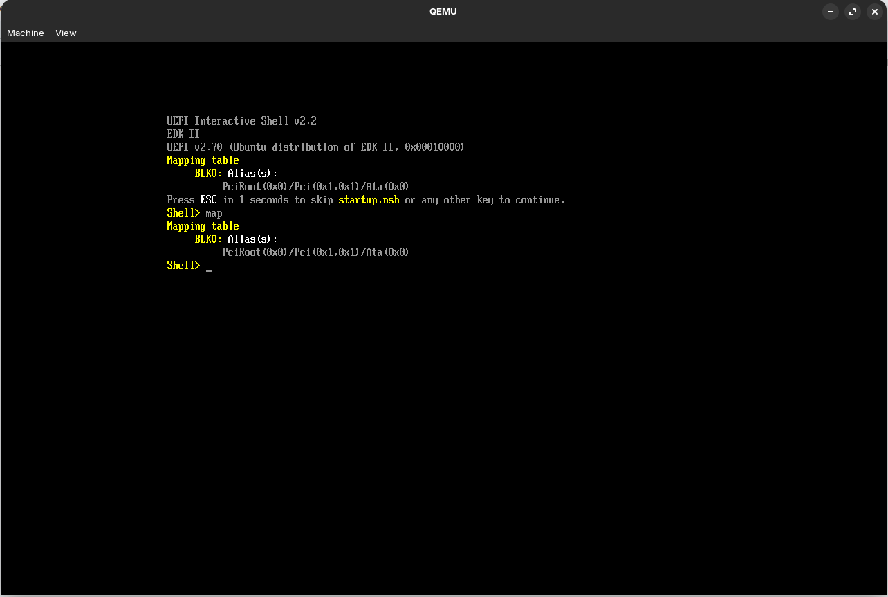
<p style="text-align: center;">Captura de pantalla del comando map</p>

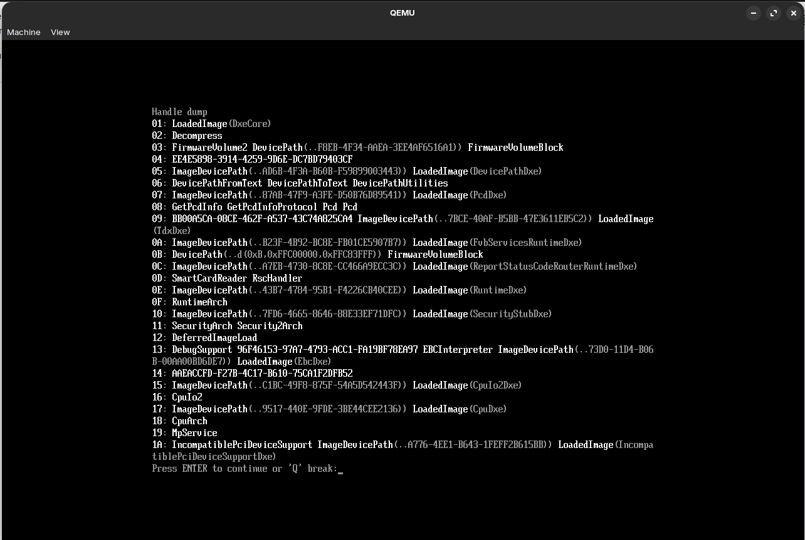
<p style="text-align: center;">Captura de pantalla del comando dh -b</p>


**¿Cuál es la ventaja de seguridad y compatibilidad frente al BIOS?**

UEFI utiliza un modelo basado en **handles y protocolos**, lo que permite abstraer el hardware y evitar dependencias directas de direcciones físicas o puertos específicos.

Esto mejora la compatibilidad entre distintos dispositivos y plataformas, y aumenta la seguridad al evitar accesos directos no controlados al hardware, reduciendo la superficie de ataque.

---

### 3.3 Variables globales (NVRAM)

Comandos:

```
dmpstore
set TestSeguridad "Hola UEFI"
set -v
```

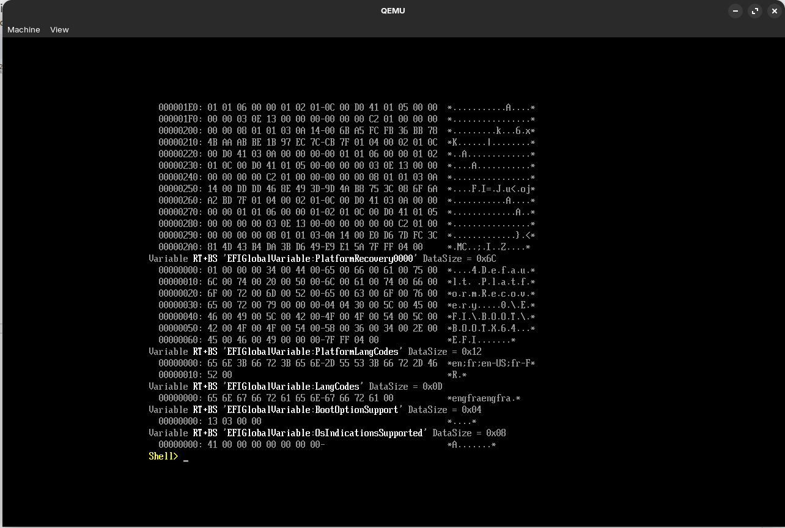
<p style="text-align: center;">Captura de pantalla del comando dmpstore</p>

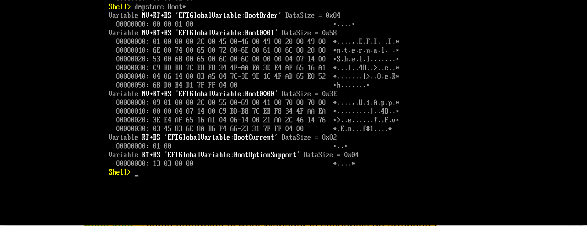
<p style="text-align: center;">BootOrder del entorno en QEMU</p>

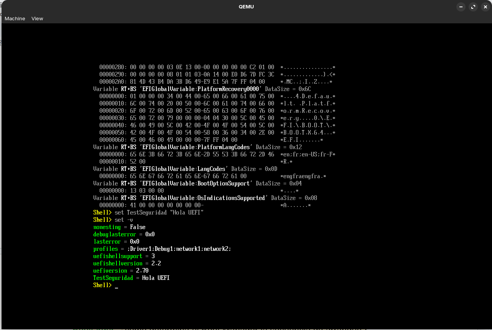
<p style="text-align: center;">BootOrder del entorno en QEMU</p>

**¿Cómo determina el Boot Manager la secuencia de arranque?**

El Boot Manager utiliza las variables `Boot####` junto con `BootOrder`, donde:

* `Boot####` representa entradas individuales de arranque
* `BootOrder` define el orden en que se intentan 

De esta forma, el firmware decide qué dispositivo o aplicación ejecutar primero. En el caso de que una opción falle en arrancar, se pasa a la siguiente.

---

### 3.4 Análisis de memoria y hardware

Comandos:

```
memmap -b
pci -b
drivers -b
```

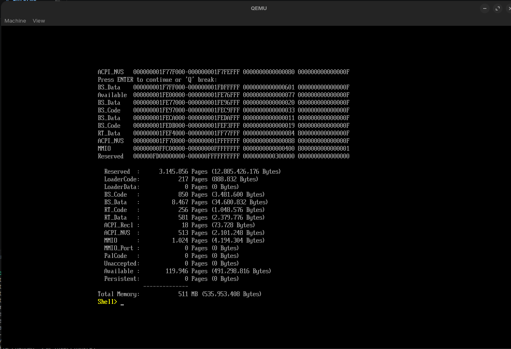
<p style="text-align: center;">Captura del comando mmap -b</p>

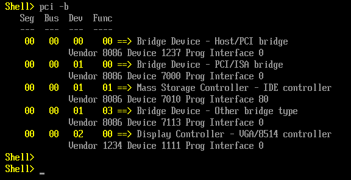
<p style="text-align: center;">Captura del comando pci-b</p>

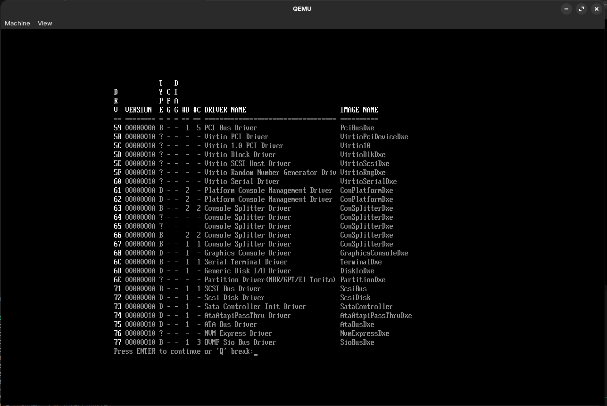
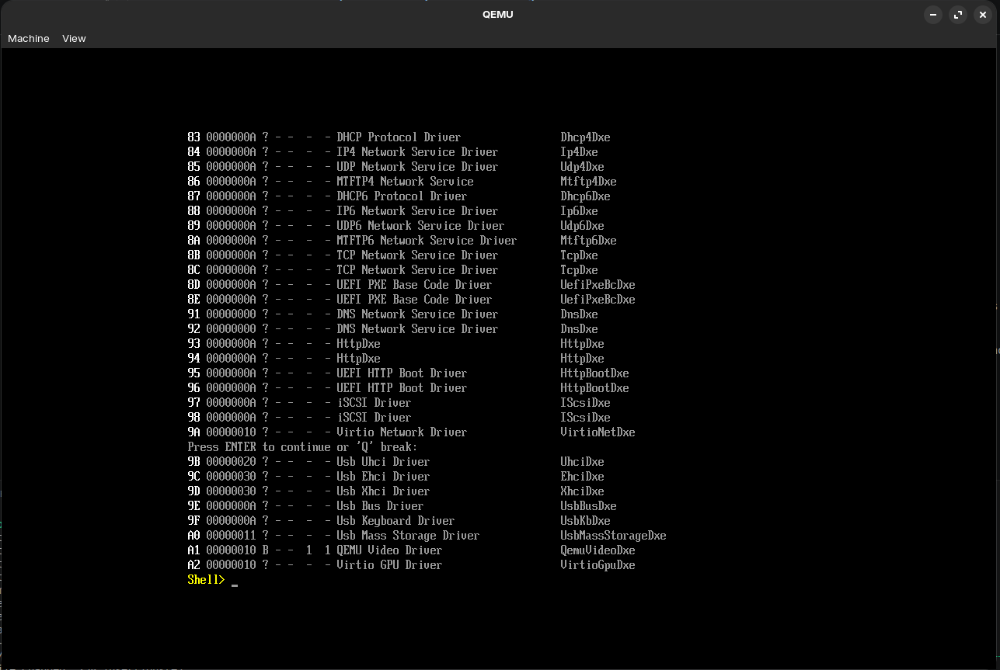
<p style="text-align: center;">Capturas del comando drivers-b</p>

**¿Por qué RuntimeServicesCode es un objetivo para malware?**

Porque esas regiones no desaparecen completamente cuando termina el entorno de prearranque. Cuando el sistema operativo llama a ExitBootServices(), la mayoría de los servicios de arranque dejan de estar disponibles, pero los Runtime Services siguen existiendo para funciones como acceso a variables UEFI, reloj y otros servicios básicos.

Entonces, si un atacante logra modificar código o datos ubicados en regiones de runtime, puede intentar mantener presencia incluso después de que el sistema operativo haya arrancado. Por eso son atractivas para bootkits: están en una zona temprana, privilegiada y persistente del proceso de arranque.

---

## 4. Trabajo Práctico 2: Desarrollo de aplicación UEFI

### 4.1 Código fuente

```c
#include <efi.h>
#include <efilib.h>

EFI_STATUS efi_main(EFI_HANDLE ImageHandle, EFI_SYSTEM_TABLE *SystemTable) {
    InitializeLib(ImageHandle, SystemTable);
    SystemTable->ConOut->OutputString(SystemTable->ConOut, L"Iniciando analisis de seguridad...\r\n");
    
    unsigned char code[] = { 0xCC };
    
    if (code[0] == 0xCC) {
        SystemTable->ConOut->OutputString(SystemTable->ConOut, L"Breakpoint estatico alcanzado.\r\n");
    }
    
    return EFI_SUCCESS;
}
```

**¿Por qué utilizamos SystemTable->ConOut->OutputString en lugar de la función printf de C?**

Porque una aplicación UEFI no corre dentro de Linux ni dentro de Windows. Corre antes del sistema operativo, en un entorno donde no existe la biblioteca estándar de C como normalmente la usamos.

printf depende de un runtime, de una salida estándar, de llamadas al sistema operativo, buffers, terminal, etc. En UEFI todavía no tenemos eso.

Esa función pertenece a los servicios de consola que ofrece el firmware UEFI. Es la manera “nativa” de imprimir texto en pantalla dentro del entorno pre-OS.

---

### 4.2 Compilación


### Compilar a código objeto
```bash
gcc -I/usr/include/efi -I/usr/include/efi/x86_64 -I/usr/include/efi/protocol \
-fpic -ffreestanding -fno-stack-protector -fno-strict-aliasing \
-fshort-wchar -mno-red-zone -maccumulate-outgoing-args -Wall \
-c -o aplicacion.o aplicacion.c
```

### Linkear (generar .so intermedio)
```bash
ld -shared -Bsymbolic -L/usr/lib -L/usr/lib/efi \
-T /usr/lib/elf_x86_64_efi.lds \
/usr/lib/crt0-efi-x86_64.o aplicacion.o \
-o aplicacion.so -lefi -lgnuefi
```

### Convertir a ejecutable EFI (PE/COFF)
```bash
objcopy -j .text -j .sdata -j .data -j .dynamic -j .dynsym \
-j .rel -j .rela -j .rel.* -j .rela.* -j .reloc \
--target=efi-app-x86_64 aplicacion.so aplicacion.efi
```

---

### 4.3 Análisis de Metadatos y Decompilación

Comandos:

```bash
file aplicacion.efi
readelf -h aplicacion.efi
```

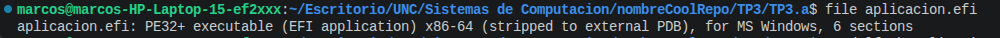
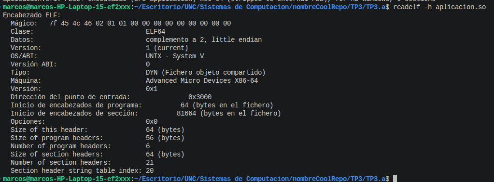

<p style="text-align: center;">Capturas de los comandos file y readelf al archivo de aplicación creado</p>

*readelf se uso con el archivo .so debido a que el comando no lee archivos .efi*
---

### 4.5 Análisis en Ghidra

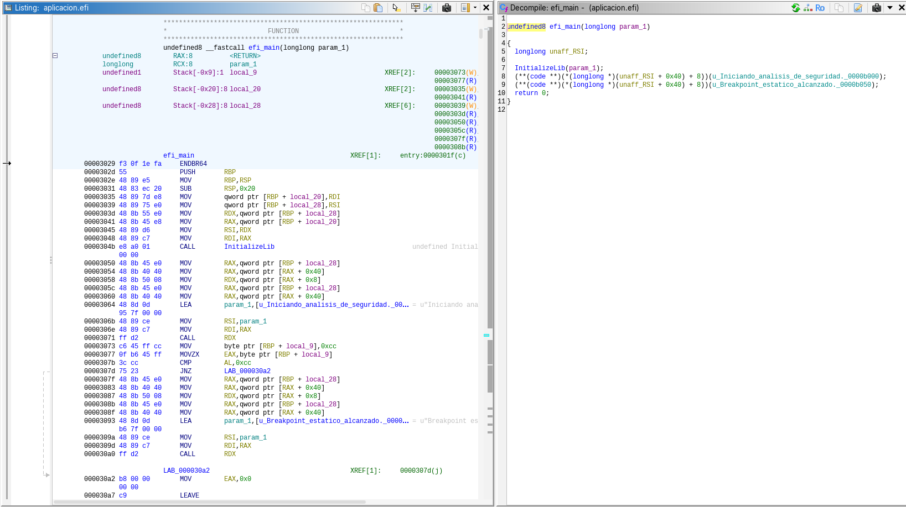

La función **efi_main** muestra claramente cómo una aplicación UEFI interactúa con el firmware sin depender de un sistema operativo. En lugar de usar bibliotecas estándar como printf, accede a la consola mediante la `EFI_SYSTEM_TABLE` y el protocolo ConOut. El análisis en Ghidra permite observar cómo las abstracciones del código C se traducen en accesos indirectos a estructuras y punteros de función. Además, el uso del byte `0xCC` permite vincular el ejemplo con conceptos de bajo nivel y análisis de seguridad, aunque en este caso el byte se compara como dato y no se ejecuta como instrucción.

**¿Por qué 0xCC aparece como -52?**

Porque 0xCC es un byte hexadecimal que vale 204 si lo interpretás como entero sin signo.

Pero si Ghidra lo interpreta como un char con signo de 8 bits, el rango posible es: -128 a 127.

En complemento a dos: 
- 0xCC = 204 unsigned
- 0xCC = -52 signed

**Esto importa en ciberseguridad** porque el mismo patrón binario puede verse distinto según el tipo de dato que use el descompilador. Si alguien analiza malware, shellcode, opcodes o buffers, puede confundirse si no distingue entre representación signed y unsigned.

---

## 5. Trabajo Práctico 3: Ejecución en hardware físico

### 5.1 Preparación del USB

```bash
sudo mount /dev/sdb1 /mnt
sudo mkdir -p /mnt/EFI/BOOT
sudo cp aplicacion.efi /mnt/
```

---

### 5.2 Configuración del firmware

* Secure Boot: Disabled
* Modo: UEFI Only

---

### 5.3 Ejecución

```
FS0:
ls
aplicacion.efi
```

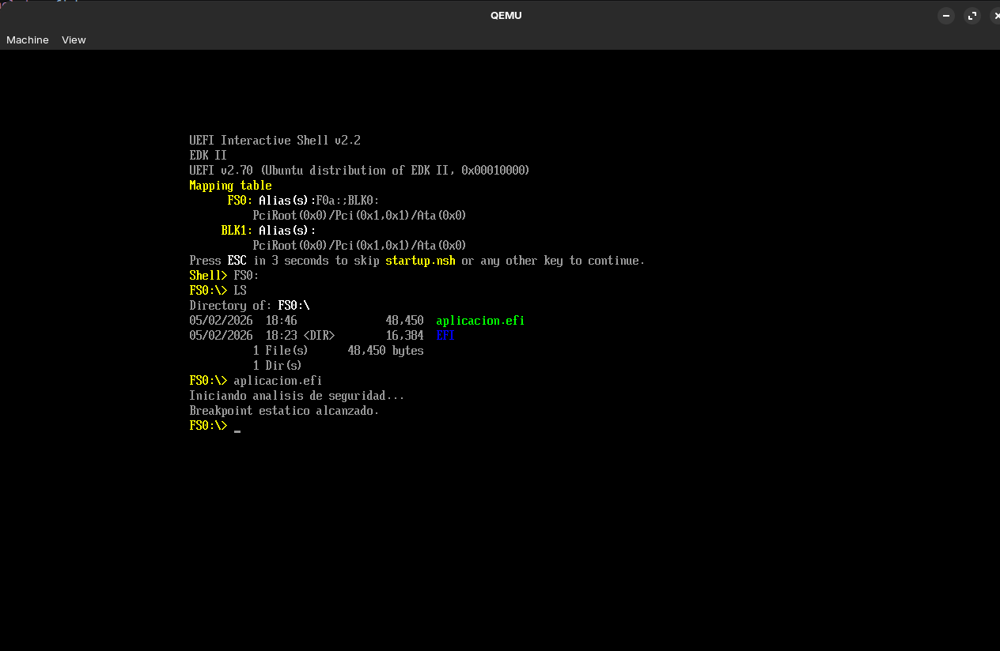

---

## 6. Conclusiones

En este trabajo se logró:

* Comprender el modelo de ejecución de UEFI
* Analizar la abstracción del hardware mediante protocolos
* Desarrollar aplicaciones nativas en entorno firmware
* Entender el formato PE/COFF
* Identificar riesgos de seguridad en fases tempranas del sistema

Además, se evidenció cómo el firmware constituye un punto crítico en la cadena de confianza del sistema, siendo un objetivo relevante para ataques avanzados como bootkits.

---
