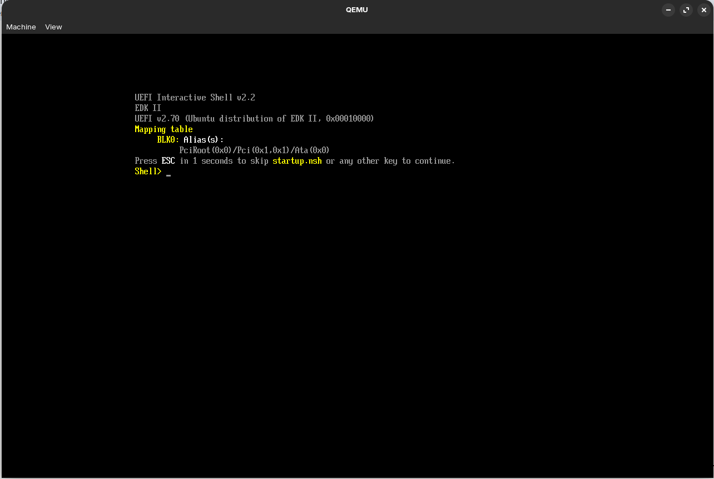

# Informe – Entorno UEFI, Desarrollo y Análisis de Seguridad

**Materia:** Sistemas de Computación
**Alumnos:** 
- Martina Juri
- Marcos Morán
- Francisco Gomez Neimann
- Cristian Eduardo Arteaga Barrera

**Vínculo al repositorio:** 
https://github.com/MMoran2001/Electrotonto-y-Computarados

**Trabajo Práctico:** TP3.a - UEFI

---

## 1. Introducción

El presente trabajo tiene como objetivo comprender la arquitectura de la Interfaz de Firmware Extensible Unificada (UEFI), analizando su funcionamiento como entorno previo al sistema operativo (pre-OS).

Se desarrollaron aplicaciones nativas en este entorno, se exploró la interacción con el hardware mediante protocolos, y se realizaron pruebas tanto en entornos virtualizados como en hardware físico.

Asimismo, se abordaron aspectos de seguridad, incluyendo el análisis de memoria, variables persistentes y ejecución de código a bajo nivel.

---

## 2. Preparación del Entorno

Se configuró un entorno de trabajo en Linux, instalando herramientas necesarias como:

* QEMU (emulación de hardware)
* OVMF (firmware UEFI open-source)
* gnu-efi (toolchain para desarrollo UEFI)
* Ghidra (ingeniería inversa)

### Comandos utilizados

```bash
mkdir -p ~/uefi_security_lab && cd ~/uefi_security_lab
sudo apt update
sudo apt install -y qemu-system-x86 ovmf gnu-efi build-essential binutils-mingw-w64
sudo apt install -y ghidra
```

---

## 3. Trabajo Práctico 1: Exploración del entorno UEFI

### 3.1 Arranque en entorno virtual

Se ejecutó QEMU con firmware UEFI:

```bash
qemu-system-x86_64 -m 512 -bios /usr/share/ovmf/OVMF.fd -net none
```



---

### 3.2 Exploración de dispositivos

Comandos utilizados:

```
map
FS0:
ls
dh -b
```

📸 *[Insertar capturas de map y dh]*


**¿Cuál es la ventaja de seguridad y compatibilidad frente al BIOS?**

UEFI utiliza un modelo basado en **handles y protocolos**, lo que permite abstraer el hardware y evitar dependencias directas de direcciones físicas o puertos específicos.

Esto mejora la compatibilidad entre distintos dispositivos y plataformas, y aumenta la seguridad al evitar accesos directos no controlados al hardware, reduciendo la superficie de ataque.

---

### 3.3 Variables globales (NVRAM)

Comandos:

```
dmpstore
set TestSeguridad "Hola UEFI"
set -v
```

📸 *[Insertar capturas]*

**¿Cómo determina el Boot Manager la secuencia de arranque?**

El Boot Manager utiliza las variables `Boot####` junto con `BootOrder`, donde:

* `Boot####` representa entradas individuales de arranque
* `BootOrder` define el orden en que se intentan

De esta forma, el firmware decide qué dispositivo o aplicación ejecutar primero.

---

### 3.4 Análisis de memoria y hardware

Comandos:

```
memmap -b
pci -b
drivers -b
```

📸 *[Insertar capturas]*

**¿Por qué RuntimeServicesCode es un objetivo para malware?**

Estas regiones permanecen accesibles incluso después de que el sistema operativo toma control.

Esto permite que un atacante (bootkit) ejecute código persistente con alto nivel de privilegio, dificultando su detección y eliminación.

---

## 4. Trabajo Práctico 2: Desarrollo de aplicación UEFI

### 4.1 Código fuente

```c
#include <efi.h>
#include <efilib.h>

EFI_STATUS efi_main(EFI_HANDLE ImageHandle, EFI_SYSTEM_TABLE *SystemTable) {
    InitializeLib(ImageHandle, SystemTable);
    SystemTable->ConOut->OutputString(SystemTable->ConOut, L"Iniciando analisis de seguridad...\r\n");
    
    unsigned char code[] = { 0xCC };
    
    if (code[0] == 0xCC) {
        SystemTable->ConOut->OutputString(SystemTable->ConOut, L"Breakpoint estatico alcanzado.\r\n");
    }
    
    return EFI_SUCCESS;
}
```

---

### 4.2 Compilación

```bash
gcc -I/usr/include/efi -I/usr/include/efi/x86_64 -I/usr/include/efi/protocol \
-fpic -ffreestanding -fno-stack-protector -fno-strict-aliasing \
-fshort-wchar -mno-red-zone -maccumulate-outgoing-args -Wall \
-c -o aplicacion.o aplicacion.c

ld -shared -Bsymbolic -L/usr/lib -L/usr/lib/efi \
-T /usr/lib/elf_x86_64_efi.lds \
/usr/lib/crt0-efi-x86_64.o aplicacion.o \
-o aplicacion.so -lefi -lgnuefi

objcopy -j .text -j .sdata -j .data -j .dynamic -j .dynsym \
-j .rel -j .rela -j .rel.* -j .rela.* -j .reloc \
--target=efi-app-x86_64 aplicacion.so aplicacion.efi
```

---

### 4.3 Ejecución

📸 *[Insertar captura ejecutando aplicacion.efi]*

---

**¿Por qué no usamos printf?**

UEFI no posee una biblioteca estándar de C como un sistema operativo.

Por lo tanto, se utilizan los servicios provistos por el firmware, accediendo a la consola mediante `SystemTable->ConOut`.

---

### 4.4 Análisis con herramientas

Comandos:

```bash
file aplicacion.efi
readelf -h aplicacion.efi
```

📸 *[Insertar capturas]*

---

### 4.5 Análisis en Ghidra

📸 *[Insertar captura del pseudocódigo]*

**¿Por qué 0xCC aparece como -52?**

Esto ocurre debido a la interpretación del valor como un entero con signo (signed).

El valor hexadecimal `0xCC` corresponde a 204 en decimal sin signo, pero al interpretarse como signed (8 bits), se convierte en -52.

Esto es relevante en ciberseguridad ya que puede ocultar patrones de código o instrucciones (como breakpoints) en análisis estático.

---

## 5. Trabajo Práctico 3: Ejecución en hardware físico

### 5.1 Preparación del USB

```bash
sudo mount /dev/sdb1 /mnt
sudo mkdir -p /mnt/EFI/BOOT
sudo cp aplicacion.efi /mnt/
```

📸 *[Insertar capturas]*

---

### 5.2 Configuración del firmware

* Secure Boot: Disabled
* Modo: UEFI Only

📸 *[Insertar capturas BIOS]*

---

### 5.3 Ejecución

```
FS0:
ls
aplicacion.efi
```

📸 *[Insertar captura final]*

---

## 6. Conclusiones

En este trabajo se logró:

* Comprender el modelo de ejecución de UEFI
* Analizar la abstracción del hardware mediante protocolos
* Desarrollar aplicaciones nativas en entorno firmware
* Entender el formato PE/COFF
* Identificar riesgos de seguridad en fases tempranas del sistema

Además, se evidenció cómo el firmware constituye un punto crítico en la cadena de confianza del sistema, siendo un objetivo relevante para ataques avanzados como bootkits.

---
